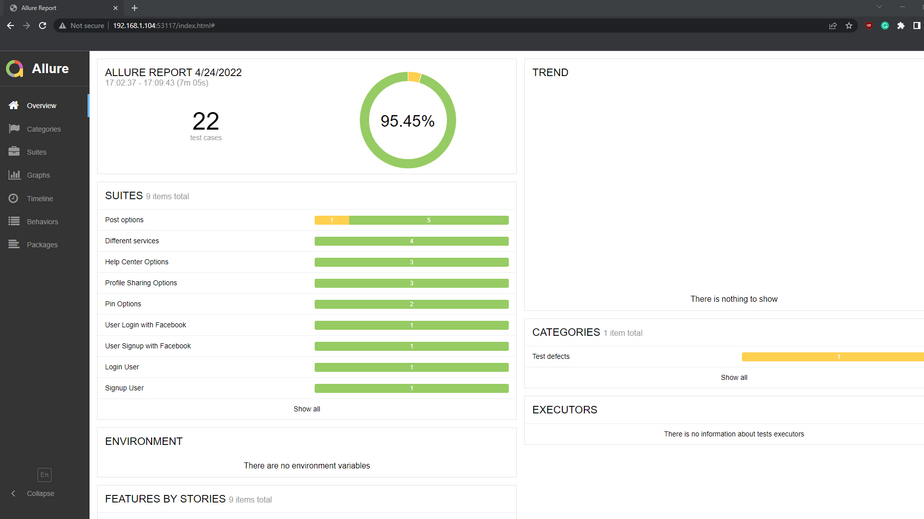
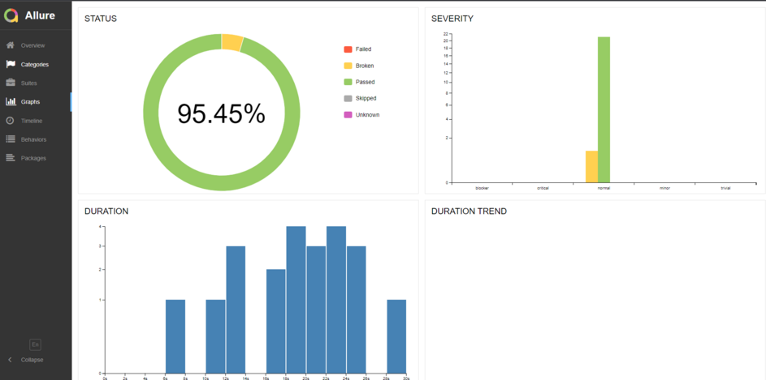

## Test automation project using Cucumber and Java
<br/>
<p>This repository contains Cucumber-Java project to perform test automation on https://www.pinterest.com. I have used TestNg for performing assertions and Allure for generating reports.</p>

---
<br/>

## Tested Website
[ Pinterest](www.pinterest.com)

## Pre-requisites (Installations):
- JDK 17.0.1+
- Maven
- IntelliJ IDE
- Allure


## Dependencies:
- cucumber-java 7.2.3
- cucumber-testng 7.2.3
- cucumber-junit 7.2.3
- selenium-java 4.1.3
- allure-cucumber7-jvm 2.17.3
- cucumber-compiler-plugin 3.10.1
- maven-surefire-plugin 3.0.0.M6
<br/>

## Running the Tests:
- Open project in IntelliJ IDE.
- Run TestNg.xml file.
- _**Note:**_ for testing signup process, change the email address on Signup.feature file located at src/test/java/features.
```Gherkin
Examples:
      | Email                  | Password | Age |
      | fikkodoltu10@vusra.com | 1212121  | 25  |
```
<br/>

## Reports:
Allure reports are generated in xml, html and json formats which are saved in allure-reports folder.
<br/>

After running the tests, open "Terminal" in IntelliJ IDE and write command allure serve allure-report to generate allure report using allure server.
```cmd
allure serve allure-report
```
<br/>

## Sample Test Reports:
<br/> 


<br/><br/>



<br/><br/>

## Author:
This project was developed by [Tariful Islam Abir](https://github.com/tariful-islam98) under supervission of **Quality Up Services (QUPS)**.
